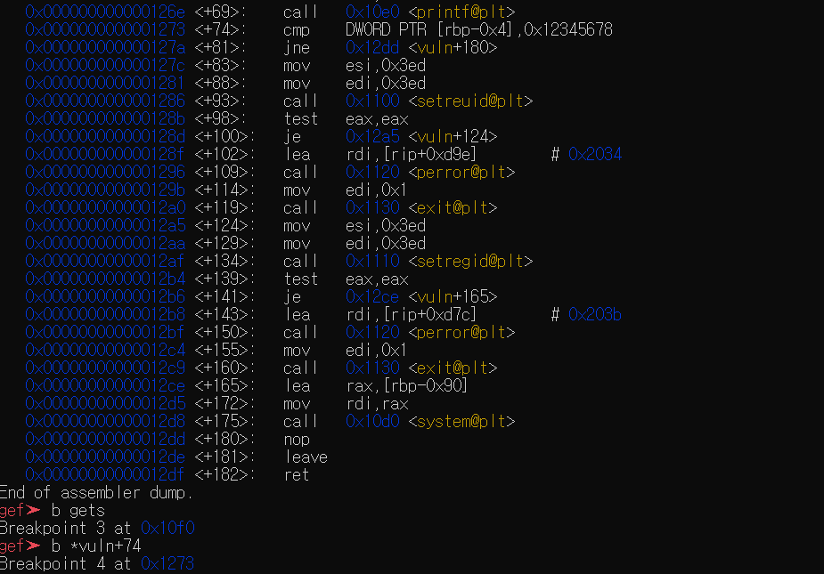
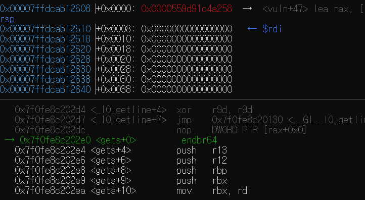
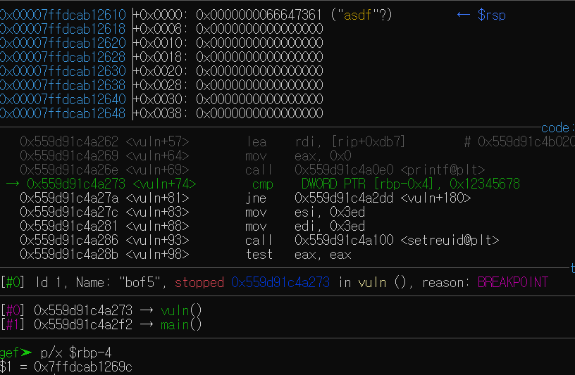
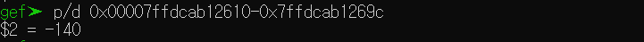
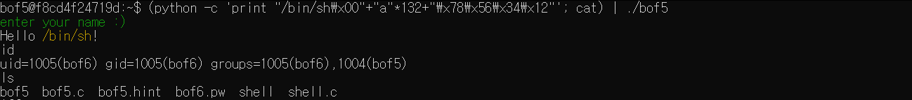

# Bof5 정리

## bof5.c

```c
#include <stdio.h>
#include <stdlib.h>
#include <unistd.h>
#define BUF_SIZE 128
#define KEY 0x12345678
#define G "\033[32m"
#define Y "\033[33m"
#define E "\033[0m"

// ASLR OFF
// STACK-PROTECTOR OFF
// STACK-EXECUTION OFF

void vuln() {
    int innocent;
    char buf[BUF_SIZE];

    puts(G "enter your name :)" E);
    gets(buf);
    printf("Hello " Y "%s" E "!\n", buf);

    if (innocent == KEY) {
        if (setreuid(1005, 1005)) {
            perror("setuid");
            exit(1);
        }
        if (setregid(1005, 1005)) {
            perror("setgid");
            exit(1);
        }
        system(buf);
    }
}

int main(){
    vuln();
    return 0;
}
```

이전 것과 다르게 `system`에 `buf`가 들어가 있다. 공격기법은 Buffer Overflow를 사용해 `innocent`와 `key`를 같게 만들어야 한다.

---

## 공격 방법

문자열은 NULL이 존재하는 곳까지를 하나의 문자열로 인식한다. `buf`에 원하는 `/bin/sh`를 입력하고 `\x00`, NULL을 입력한 뒤 Dummy 값을 넣어 `innocent` 값을 원하는 값으로 저장할 수 있게 한다.

---

## `innocent`와 `buf` 사이의 크기



`buf` 시작을 알기 위해 `gets`와 `innocent`의 시작을 알기 위해 `cmp`에 breakpoint를 건다.



`gets` 함수에서 break를 걸어, rdi 레지스터에 저장된 주소값을 확인한다.



```c
if(innocent == KEY){
    ...
}
```

`cmp` 명령어는 이곳에서 실행된다. `innocent`의 주소값을 확인한다.



위에 볼 수 있듯이 `innocent`와 `buf` 사이의 거리는 140인 것을 알 수 있다.

---

## 결과



프로그램에서 `buf`를 `/bin/sh\x00`으로 입력시키면 8바이트가 소모되기 때문에 Dummy 값을  `128`만큼 넣는다. `innocent`는 `key` 값으로 넣는다.

`id` 명령어를 입력해보니 변한 것을 알 수 있습니다.