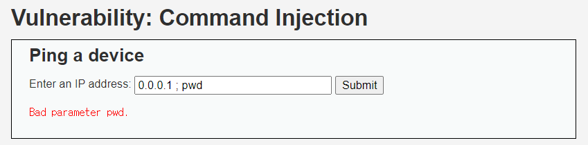
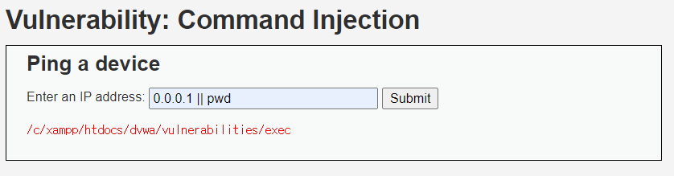
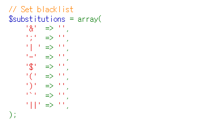
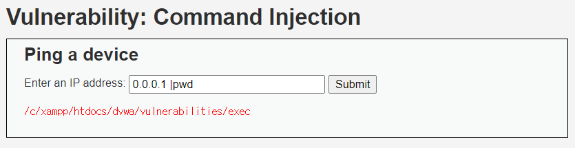

# Command Injection (HIGH)

## 문제

사용자에게 IP 주소를 입력받고 `ping` 명령을 실행해 결과값을 보여준다. 전에 방법들과 마찬가지로 공격을 시도했는데 위와 같이 출력된다.

---

## 방법

-> `;`, `|`, `&&`, `&`. 이 문자들도 예외 처리를 시켜 위와 같이 출력되었다.

하지만 `||` 이 문자는 예외 처리를 하지 않아서 실행이 되었다.

PHP 소스코드를 보니 알고보니 `||`도 막았는데 오류로 인해 입력된 것이다. 

이 문제는 세번째 줄에 보이는 개발자의 실수를 이용하는 것이었다. `'| '` 뒤에 공백이 있었다. 

그래서 위와 같이 `|` 뒤에 명령어를 바로 붙여 입력했더니 성공했다.