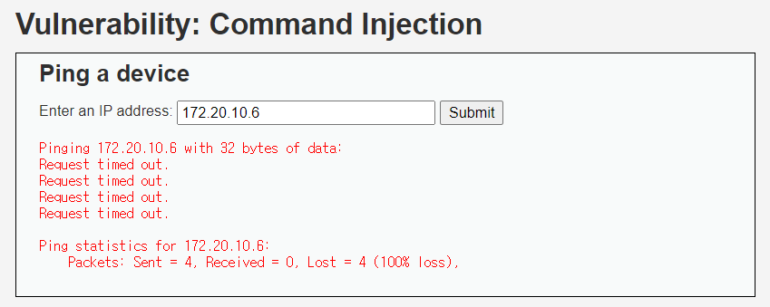
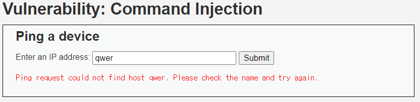
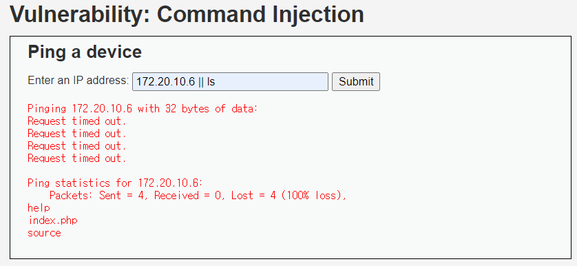
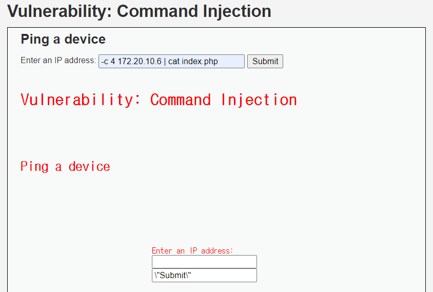

# Command Injection (LOW)

## 문제

사용자가 IP를 입력하면 위와 같이 나온다. `system` 함수를 통해 `ping` 명령을 사용한다.

---

## 방법

qwer을 입력해봐 `ping` 명령어를 실행하는지 확인했다.

Command Injection 공격은 `system` 함수와 같은 취약한 함수를 쓰는 코드를 통해 사용자가 쉘 명령을 내리는 것이다.

개발자가 실행하려던 명령을 실행한 다음 `||`, `&`, `|`, `&&`, `;` 들을 사용해 원하는 명령도 실행하게 한다.

위와 같이 입력하면 코드 상에서 `shell_exec("ping 172.20.10.6 || ls")` 라고 인식이 되어 두 개의 명령을 다 실행하는 것을 볼 수 있다. 

위와 같이 서버 안에 파일도 열 수 있다.

