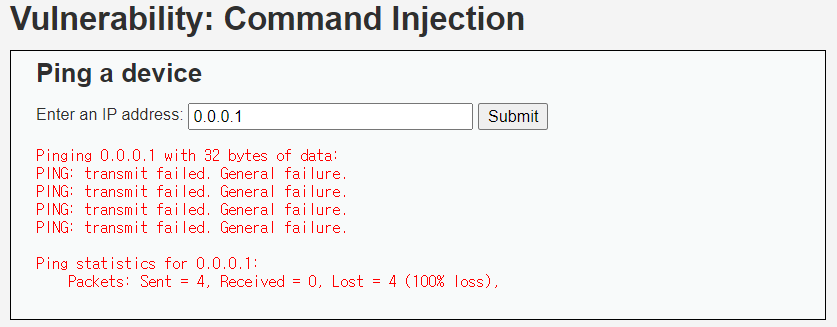
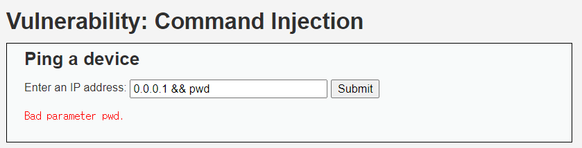
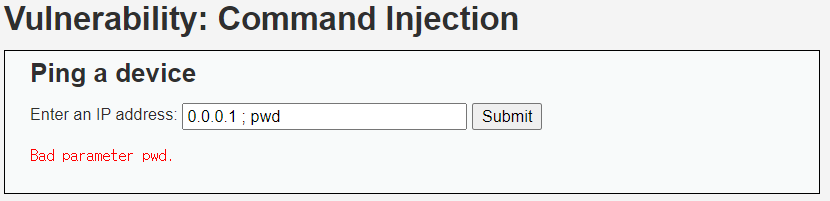

# Command Injection (MID)

## 문제

사용자가 IP를 입력하면 `ping` 명령을 실행해 결과를 보여준다.

---

## 방법

[이전에 했던 방법](Command_LOW.md)에서 두 가지 방법으로 해보았는데 `&&`, `;` 는 인식해서 예외처를 해놓은 것 같다. 나머지 방법으로 해보자

`&`, `||`, `|` 은 위와 같이 명령을 실행함을 볼 수 있다.