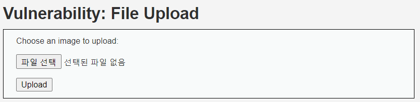
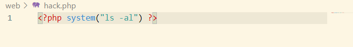
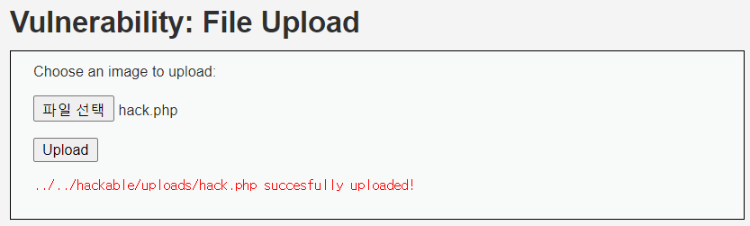
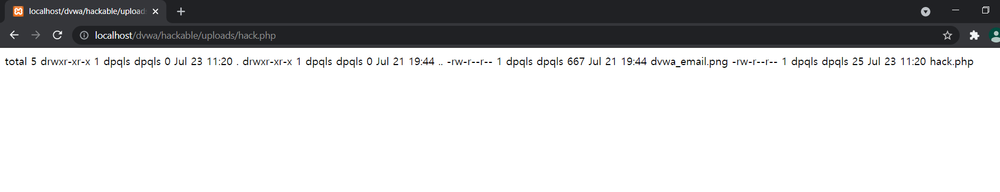

# File Upload (LOW)

## 문제

Image 파일을 Upload하는 페이지이지만, image 파일만을 받도록 설정하지 않아 의도적으로 소스코드를 Upload 해서 서버 안에서 원하는 명령을 실행되도록 하는 것이다.

---

## 방법

hackp.php 라는 파일을 위와 같이 작성한다. 서버 안에서 원하는 명령이 실행되도록 만드는 것이다.

성공적으로 Upload가 되었고 파일의 위치를 알려주었다.

위치로 이동시켜 보니 위와 같이 성공적으로 명령이 실행된 것을 볼 수 있다.