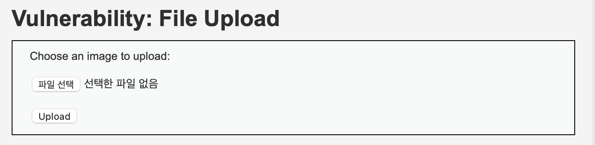
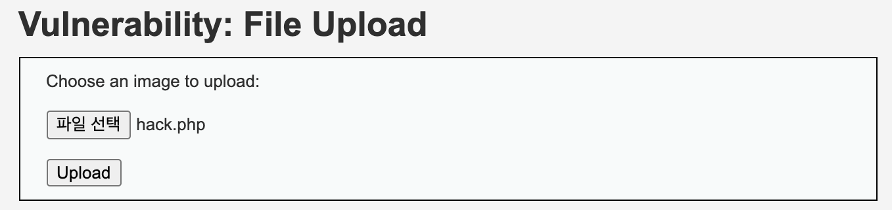
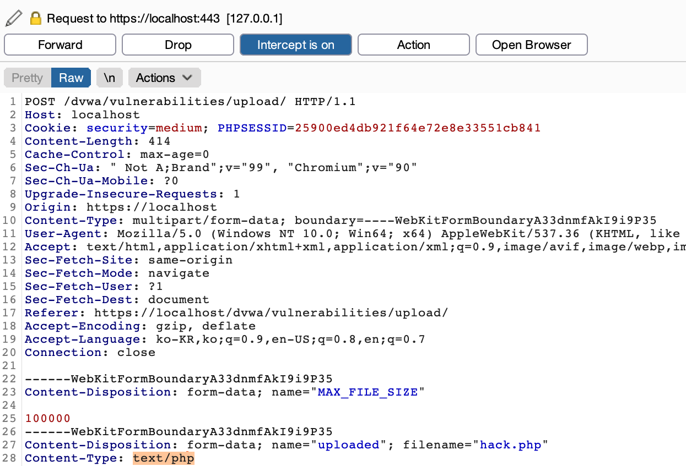
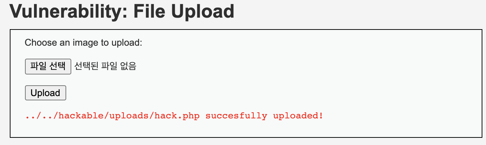
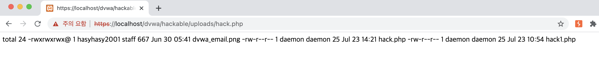

# File Upload (MID)

## 문제

이 문제는 전과 비슷한 문제이지만 이번에는 JPEG, PNG 파일만을 Upload 할 수 있다.

---

## 방법

hack.php 파일을 만들어 Upload를 한다.

burp suite를 통해 `content-type`을 `image/jpeg` 로 바꾼다.

성공적으로 Upload된 것을 확인할 수 있다.

파일 위치로 가보니 성공적으로 hack.php가 실행된 것을 확인할 수 있다.