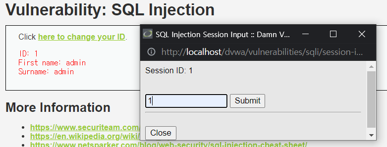
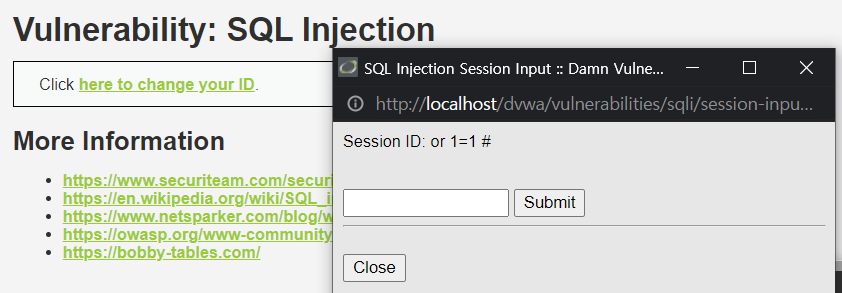
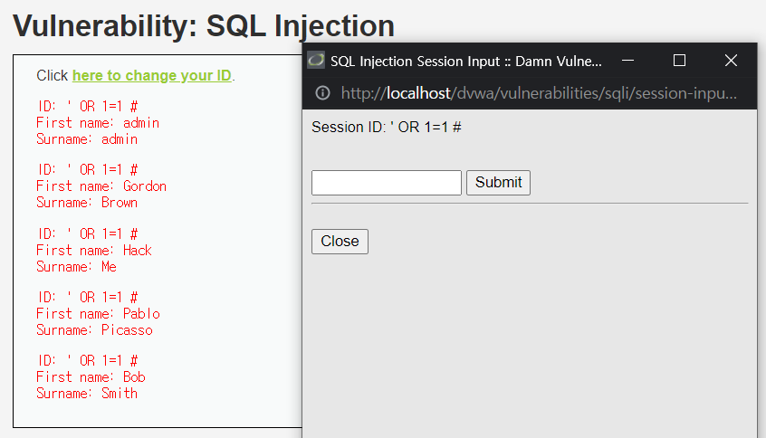

# SQL Injection (HIGH)

## 문제

위 문제는 사용자의 입력한 ID에 따라 출력값이 다르다.

ID를 입력할 때 Query 문을 작성하면 될 것 같다.

 

## 방법

ID에 `OR 1=1 #`을 넣어보니 문자 그대로 입력되는 것을 볼 수 있다.

`WHERE user_id = '$id';` 이 문이 써있는 것을 예상할 수 있다.

 

ID에 `'OR 1=1 #`을 넣어보니 예상대로 모든 출력된 것을 확인할 수 있다.