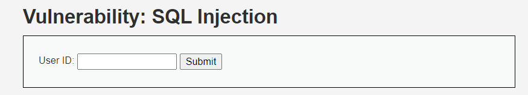
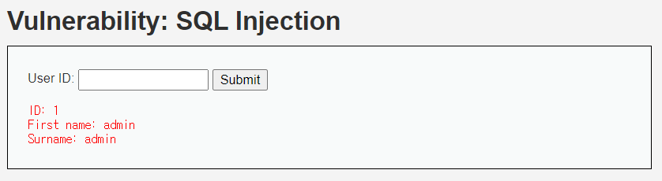
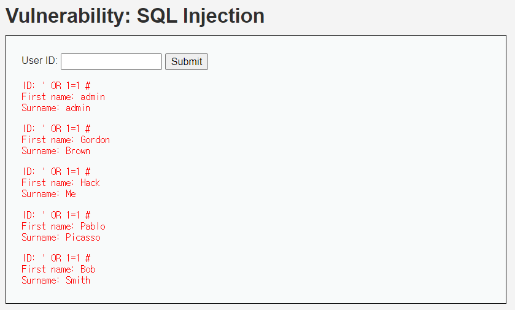

# SQL Injection (LOW)

## 문제

SQL_Injection 문제이다. 빈 칸에 Query, SQL 문을 넣어 Database를 원하는데로 작동하게 만들어야 한다.

## 방법

1~5 값을 넣어보니 id에 따라 출력값이 다른 것을 알 수 있다.

select 문과 where 문이 사용된 것을 예상할 수 있는데 기본 SQL Injection 구문을 넣어보자.

 

`'OR 1=1 #`을 넣어보니 데이터베이스의 모든 값이 출력된 것을 볼 수 있다.