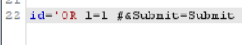

# SQL Injection (MID)

## 문제

 

이 문제는 서버로 값을 보낼 때 그 값을 수정해야한다.

두 가지 방법이 있다. `F12`를 눌러 `value`를 수정하거나 Burp Suite 라는 프로그램을 사용해 보낼 값을 중간에서 수정할 수 있다. 두번째 방법을 사용할 것이다.

## 방법

 

ID 별로 출력값이 달라지는 것을 볼 수 있다. select와 where 구문을 예상할 수 있다.

 

Burp Suite 프로그램으로 값을 해보니 이렇게 전달되는 것을 볼 수 있다.

 

ID를 위와 같이 수정해서 서버에 보내본다

 

위와 같은 에러를 확인할 수 있다. id로 보낸 값이 그래도 sql 문에 입력된다는 것을 확인할 수 있다. 그리고 `'` , 작은 따옴표는 인식을 하지 못하는 거 같다.

그러면 `where user_id = $id;` 이러한 구문이 있을 것 같다.

 

그러면 ID 변수에 값을 넣어놓고 모든 경우가 참이 되게 하면 될 것 같다.

그래서 ID 에 `1 OR 1=1 #`을 넣어보니 위와 같이 모든 값이 출력된 것을 볼 수 있다.