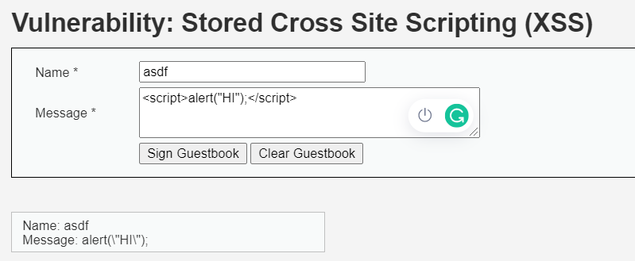
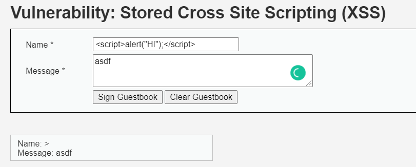
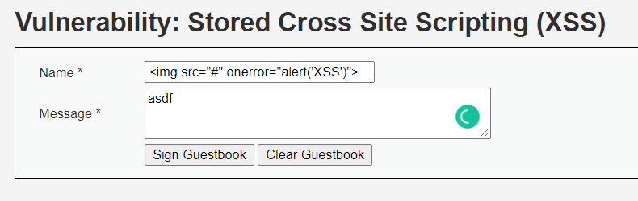
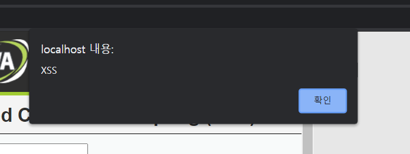
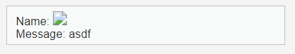
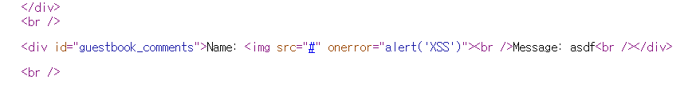

# XSS (HIGH)

## 문제

이전 MID 문제와 같이 Name이나 Message에 소스코드를 입력시킨다.

 

---

 

## 방법

 

먼저 기본으로 자바 스크립트 문을 입력 시켜보았다.

스크립트 태그를 무시하고 그 안에 문자열만 입력받은 것을 볼 수 있다.

다음으로 Name 에도 입력해봤는데 이번에는 마지막 문자만 출력되었다.

다른 방식은 HTML Tag 방식을 사용했다. Name의 최대 입력값을 늘렸다.

경고 메세지와 출력값이 의도한데로 나왔다.

웹페이지 소스코드도 보니 잘 수정되었다.