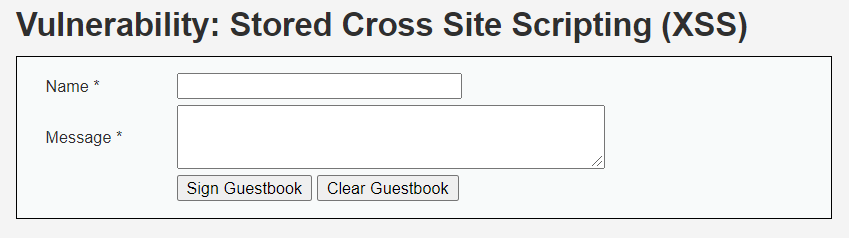
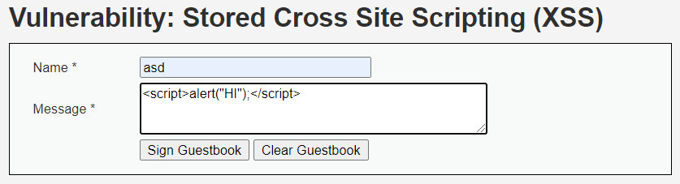
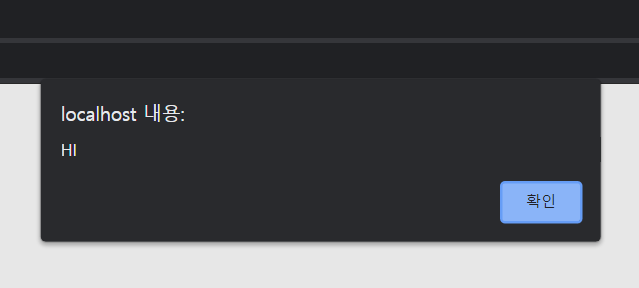
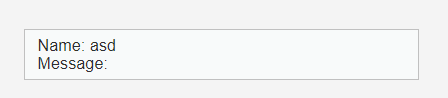
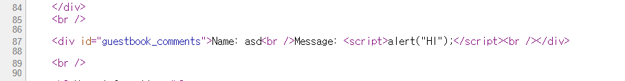

# XSS (LOW)

## 문제

위 문제는 XSS(Cross Site Scripting) Stored 방식으로 푸는 문제이다. 간단히 말해 게시판 글을 통해 Web page의 소스코드를 추가해 다음 사용자의 정보를 빼내오는 것이다. 

간단히 우리가 추가한 코드가 잘 실행되면서 게시판에는 뜨지 않는 것을 확인한다.

 

## 방법

Message에 javascript문을 적어 넣는다.

 

그러면 다음과 같이 코드가 실행된 것을 볼 수 있다.

 

그리고 등록된 게시글을 보면 입력한 코드는 보이지 않는 것을 확인할 수 있다.

 

페이지의 소스코드를 보면 입력한 코드가 잘 들어간 것을 확인할 수 있다.

