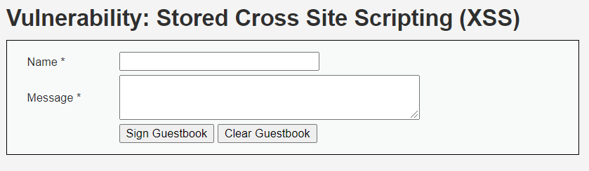
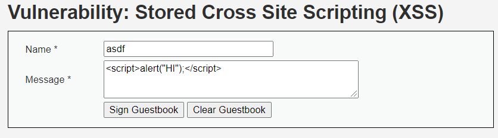
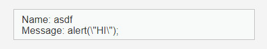
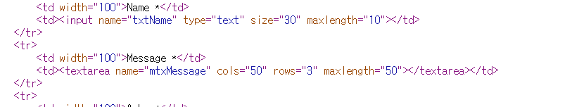
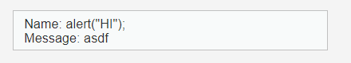
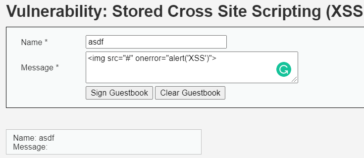
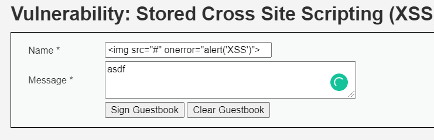
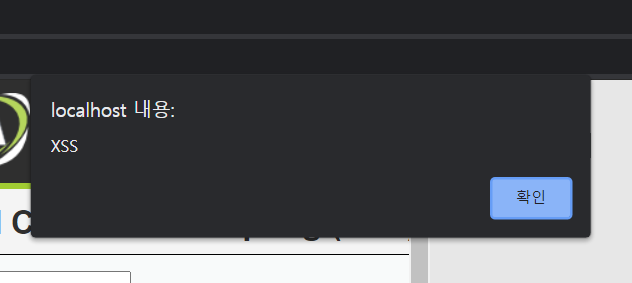
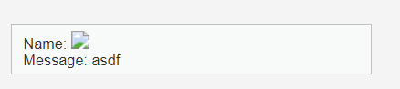
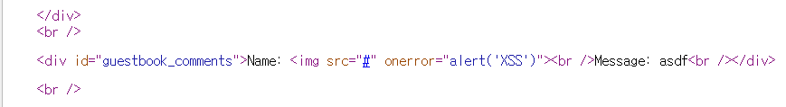

# XSS (MID)

## 문제

Name이나 Message에 소스코드를 입력해 웹페이지를 영구적으로 수정한다.

 

---

 

## 방법

 

처음은 이전에 시도했던 방법을 Message 칸에 입력했다.

그랬더니 코드가 실행되지 않고 스크립트 태그 안에 있는 내용이 입력된 것을 확인할 수 있었다. 스크립트 태그는 무시되는 거 같다.

웹페이지의 소스코드를 보니 Name 입력은 길이가 10으로 제한되어 있었다. 이것을 개발자 모드를 통해 고치고 Name에 입력시켜 보자.

Message 칸에 했던 거와 같은 결과를 얻을 수 있었다.

이번에는 HTML 태그를 이용해 보았다. Message 칸에 넣어 해보았더니 출력에는 보이지 않았다. 입력은 되는데 웹페이지 소스코드는 수정되지 않은 거 같다.

Name의 최대 입력값을 늘리고 HTML 태그 방식을 입력했다.

코드가 정상적으로 실행되었다. 경고 메세지가 뜨고 출력값이 의도한데로 나온 것을 볼 수 있다.

웹페이지 소스코드도 잘 수정되었다. 